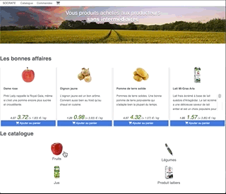
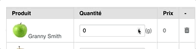
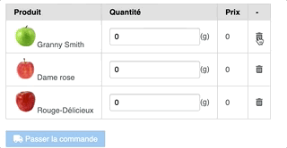
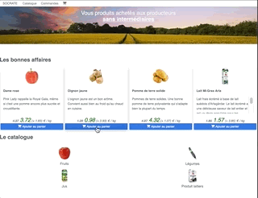
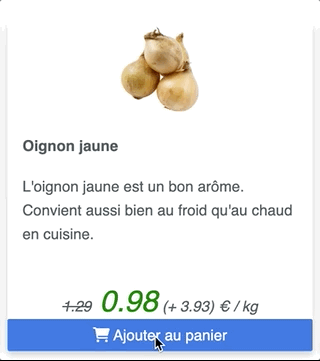
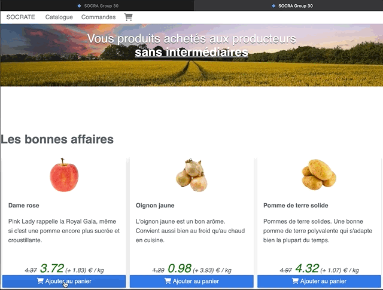
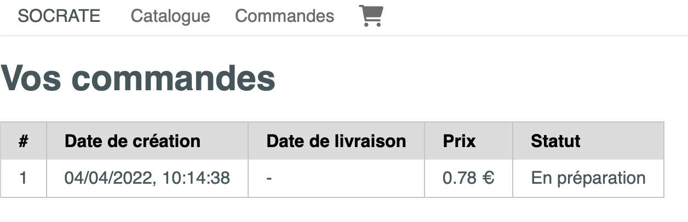
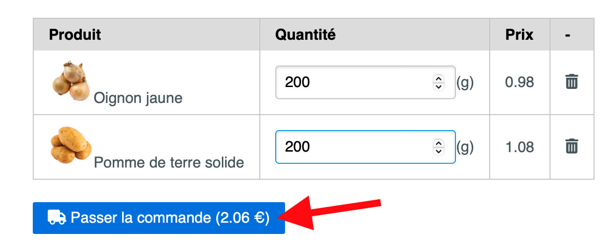
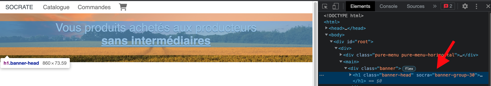

# Frontend Workshop

This is the subject of the frontend workshop for students of EPITA - SIGL 2023.

The aim of the workshop is to implement a user interface (UI) for Socrate.
To implement it, we will use:

- [NodeJS](https://nodejs.org/en/about/): to be able to use dependencies (other developper's code)
- [PureCSS](https://purecss.io/): to have some small help on making our application responsive
- [ReactJS](https://fr.reactjs.org/): to manage DOM elements rendering and local component state
- [Webpack](https://webpack.js.org/): to bundle all our source files into a single `JavaScript` file (that will be our production artifact)

> Note: We are doing only the user interface without any data persistency...for now!

## Step 0: Tools

### IDE

We strongly encourage you to use [Visual Studio Code](https://code.visualstudio.com) for your frontend project.
It's totally free and open source (even written in TypeScript!).

You don't have to install any extra plugins for this workshop.

### Install NodeJS

You need to install NodeJS (a.k.a `node`) on your local machine.

Because NodeJS is a tool that evolves fast and has multiple versions, we will use a versionning tool to help us using multiple versions, depending on the project we're working on: [NVM](https://github.com/nvm-sh/nvm) (Node Version Manager)

To install `nvm`, follow instructions in the README of the project: https://github.com/nvm-sh/nvm#installing-and-updating

Once `nvm` is install:

- Create a file `.nvmrc` with `v16` inside
- Install node v16 using `nvm`: `nvm install v16`

Then, everytime you work on your project, you can type `nvm use` command, and it will switch you to the version inside the `.nvmrc` file.

You can verify if everything is fine by checking node version: `node -v`
and it should output version 16.

## Step 1: Make me responsive!

For this part, you will only code HTML and CSS.

- Clone the [responsive-template](https://github.com/socra-sigl-2023/responsive-template) on another directory on your machine
- Go into the `responsive-template` folder you've just cloned, and run:

```sh
# Make sure you are using NodeJS version 16.
# If you have nvm; just run nvm use
nvm use
# > `node -v` should output v16.x.x
npx http-server .
```

- Open your browser on [localhost:8080](http://localhost:8080)

This project is using 2 sources of style:

- [PureCSS](https://purecss.io/)
- [Custom styles.css file](https://github.com/socra-sigl-2023/responsive-template/blob/main/styles.css)
- [Image for the background banner](https://github.com/socra-sigl-2023/responsive-template/blob/main/public/images/countryside.jpg)

We use PureCSS just by referencing a public URL which expose the minified CSS code of pure.
[See index.html file's <link> tags](https://github.com/socra-sigl-2023/responsive-template/blob/008f1203890ab7b48aebd31dc5129849aa6fd01c/index.html#L6)

> Note: Our `styles.css` is the last <link /> for a reason. Browser reads html file from top to bottom. So if you want to override properties from the PureCSS's css file, you need to place your file after pure css imports.

About socrate layout:

- This is only an non-reactive home page. No actions are triggered when using menu links and buttons.

About the responsiveness:

- The template uses [media queries](https://www.w3schools.com/css/css_rwd_mediaqueries.asp) which is native CSS, so built-in with browsers. See [how the template uses media queries](https://github.com/socra-sigl-2023/responsive-template/blob/008f1203890ab7b48aebd31dc5129849aa6fd01c/styles.css#L142)

Feel free to take few minutes to change the style of socrate, by editing [styles.css](https://github.com/arla-sigl-2022/responsive-demo/blob/main/styles.css) on your local host.

Here are some usefull links:

- [Matrial Color Tool](https://material.io/resources/color/#!/?view.left=0&view.right=0): pick colors that goes well together
- [PureCSS responsive grids](https://purecss.io/grids/): docs for component this template is using
- [Extend PureCSS](https://purecss.io/extend/): to customize a bit the default design of PureCSS component.
- [I don't want to use any css framework, let me use Flexbox!](https://developer.mozilla.org/en-US/docs/Learn/CSS/CSS_layout/Flexbox): This is what PureCSS is based on. Flexboxes in CSS are the main component to help you build responsive website.


## Step 2: Add ReactJS and webpack 

Sofar, we have a responsive application, but we don't handle any user interactions (menu selection or button clicks).

[ReactJS](https://fr.reactjs.org/) is a JavaScript framework from FaceBook.
We chose this since it seems to be the most notorious one, when checking [NodeJS framework trends](https://www.npmtrends.com/@angular/core-vs-angular-vs-react-vs-vue-vs-svelte) with its competitors.

Facebook has lots of project in ReactJS. So they published and maintain a project called [create-react-app](https://create-react-app.dev/). This project is use to generate a fresh new frontend project using react and other tools that matches the react eco-system.

Because it adds a lot of boilerplate for our use case, **we decided NOT to use it** and create our own template instead.

- From your project's repository (e.g. `socra-group30`), create a new `frontend` folder with the content of this [frontend's workshop template folder](template/) by typing the following commands in your terminal:

```sh
# From your project's repository (e.g. socra-group30)

# should use node version 16
nvm use v16

# This will create a new frontend repository
mkdir frontend

# copy the workshop's folder template to the fresh frontend/ directory
cp -r <path/to/this/workshop>/template/ frontend/

cd frontend
npm install
npm start
#> You should see a `Welcome to React!!` message on http://localhost:8080
```

Congrats, we have a fresh new ReactJS project!

You should have the following tree inside `frontend` folder (ignoring `node_modules`):

```plain
# From your project's repository
frontend
├── config
│   ├── webpack.common.js
│   ├── webpack.dev.js
│   └── webpack.pro.js
├── package.json
├── public
│   ├── favicon.ico
│   ├── images
│   │   └── countryside.jpg
│   └── index.html
└── src
    ├── App.js
    ├── data
    │   ├── categories_fr.json
    │   ├── discounts_fr.json
    │   └── products_fr.json
    ├── index.css
    └── index.js

5 directories, 13 files
```

Now every time you will save code changes, the page on your browser will automatically reload with the new verstion.

> Note: Hot reload could sometime fail. In this case, just run `npm start` again

#### What do we call React Component?

**It's a `function` that returns a React DOM element**.

React provide a DSL called JSX to create DOM element in a convinient way.

Those two codes are EQUIVALENT:
- using JSX notation:
```jsx
  <div>My Content!</div>
``` 
- using plain JavaScript
```js
React.createElement("div", null, "My Content!")`)
```

If we look at the `frontend/src/App.js`:
```jsx
// ...

function App() {
    return <h1>Welcome to React!!</h1>
}
// ...
```

`App` is a React component because it's a function that returns a React DOM Element.

#### How to use React Components?

A React component can take properties.

Modify your `frontend/src/App.js` with the following:
```jsx
import React from "react";

function Greetings({framework}) {
  return (
    <h1>Welcome to {framework}!!</h1>
  )
}

function App({framework}) {
    const frameworkName = "React";
    return <Greetings framework={frameworkName} />
}

export default App;
```
- We created a new Greeting React components taking `framework` properties
> Note: the `function Greetings({framework}) { ... }` is using [object destructuring JavaScript's feature](https://developer.mozilla.org/en-US/docs/Web/JavaScript/Reference/Operators/Destructuring_assignment#object_destructuring)
- And use this React component inside the `App` React component, passing `"React"` as framwork property.

By default, all React components has a `children` proprety, to retrieve childens component in a child React component.

For instance:
```js
import React from "react";

function Greetings({framework, children}) {
  return (
    <div>
      <h1>Welcome to {framework}!!</h1>
      {children}
    </div>
  )
}

function App({framework}) {
    const frameworkName = "React";
    return (
      <Greetings framework={frameworkName}>
        <span>It's awesome.</span>
        <i>And it's simple!</i>
      </Greetings>
    )
}

export default App;
```

Try it out on your http://localhost:8080, you have hot reload!

> Note: make sure `npm start` is still running from `frontend/` folder

#### What about styles?

It's very similar to plain HTML.

Let's add some styles for the title: make it red!

- Create a file `frontend/src/App.css` with :
```css
.greetings-title {
  color: red;
}
```
- Import the `frontend/src/App.css` file and attach CSS class using `className` attribute to your `frontend/src/App.js`:
```jsx
import React from "react";
import "./App.css";

function Greetings({framework, children}) {
  return (
    <div>
      <h1 className="greetings-title">Welcome to {framework}!!</h1>
      {children}
    </div>
  )
}

function App({framework}) {
    const frameworkName = "React";
    return (
      <Greetings framework={frameworkName}>
        <span>It's awesome.</span>
        <i>And it's simple!</i>
      </Greetings>
    )
}

export default App;
```

That's it!

Now you should see your title in red on http://localhost:8080 

#### What is my entry point?

The entry point is the `frontend/src/index.js` file:
```jsx
import React from 'react';
import ReactDOM from 'react-dom';
import './index.css';
import App from './App';

ReactDOM.render(
  <React.StrictMode>
    <App />
  </React.StrictMode>,
  document.getElementById('root')
);
```

This code creates all DOM element **inside the `<div id="root"></div>` of the `frontend/public/index.html` file.

This is what links all your react component to the real HTML DOM.

#### About the build pipeline

We configured webpack and babel to transpile all JSX element to JavaScript when building the application for dev and production.

All webpack configuration lives inside `frontend/config` folder.

Also, project uses [webpack css loader and style loader](https://webpack.js.org/loaders/css-loader/) to append all styles in the final html.

Running `npm run build` from `frontend/` will create a production version of the frontend inside the `frontend/dist` folder. This version will be read by the browser.

> Note: this transpiling step is necessary, since your browser unsertands JavaScript only not React JSX!
> Feel free to look at the bundle generated after `npm run build` command


### Configure your html file correctly

Objective: you will use this JSX notation to re-create the home view from previous step.

We will merge your responsive template from Step 1 to the code we just generated.

- Add responsive template links to inside the header's section:
- Rename `frontend/public/index.html`'s `<title />` to your group's name

```html
<title>SOCRA Group XX</title>
```

### Create the responsive template page with React


We configured webpack and babel to transpile all JSX element to JavaScript when building the application for dev and production.

> Note: this transpiling step is necessary, since your browser unsertands JavaScript only not React JSX!
> Feel free to look at the bundle generated after `npm run build` command

You will use this JSX notation to re-create the home view from previous step.

- Let's create a handfull of new ReactJS components:
  - `frontend/src/Home.js`
```jsx
import React from "react";
import Banner from "./Banner";
import Category from "./Category";
import Discounts from "./Discounts";

function Home() {
  return (
    <>
      <Banner />
      <Discounts />
      <Category />
    </>
  );
}

export default Home;
```

- `frontend/src/Banner.js`

```jsx
import "react";
import "./Banner.css";

function Banner() {
  return (
    <div className="banner">
      <h1 className="banner-head">
        Vous produits achetés aux producteurs
        <br />
        <u>
          <b>sans intermédiaires</b>
        </u>
      </h1>
    </div>
  );
}

export default Banner;
```
- with its styles `frontend/src/Banner.css`

```css
.banner {
  background: transparent url("/public/images/countryside.jpg") 0 0 no-repeat
    fixed;
  background-size: contain;
  width: 100%;
  height: 220px;
  margin-bottom: 3em;
  display: flex;
  flex-direction: column;
}

.banner-head {
  text-align: center;
  font-size: 2em;
  font-weight: normal;
  color: white;
  text-shadow: 0 1px 1px black;
}

@media (max-width: 680px) {
  .banner {
    background: transparent;
    background-color: olive;
  }
}
```

- `frontend/src/Discounts.js`

```jsx
import React from "react";
import ProductCard from "./ProductCard";
import discounts from "./data/discounts_fr.json";

function Discounts() {

  return (
    <div className="pure-g deals">
      <h1 className="pure-u-1">Les bonnes affaires</h1>
      {discounts.map((product, idx) => (
        <ProductCard key={idx} product={product} />
      ))}
    </div>
  );
}

export default Discounts;
```

- `frontend/src/ProductCard.js`

```jsx
import React from "react";
import "./ProductCard.css";

const Price = ({ product }) => {
  const { price, discount } = product;
  let Price = <></>;
  if (discount) {
    Price = (
      <>
        <s>{price}</s>
        <span className="discount"> {discount}</span>
      </>
    );
  } else {
    Price = <span>{price}</span>;
  }
  return Price;
};

function AddToBasket() {
  return (
    <button className="pure-button pure-button-primary">
      <i className="fa fa-shopping-cart"></i> Ajouter au panier
    </button>
  );
}

function ProductCard({ product }) {
  const { name, image, description, carbonTax } = product;
  return (
    <div className="pure-u-1 pure-u-md-1-3 pure-u-xl-1-4">
      <div className="card">
        <div className="card-header">
          </img>
        </div>
        <div className="card-content">
          <h4>{name}</h4>
          <p>{description}</p>
        </div>
        <div className="card-footer">
          <span>
            <i>
              <Price product={product} /> (+ {carbonTax}) € / kg
            </i>
          </span>
        </div>
        <div className="card-actions">
          <AddToBasket />
        </div>
      </div>
    </div>
  );
}

export default ProductCard;
```

- with its styles `frontend/src/ProductCard.css`:

```css
.card {
  box-shadow: 0 4px 8px 0 rgba(0, 0, 0, 0.2);
  transition: 0.3s;
  margin: 5px;
  display: flex;
  flex-direction: column;
}

.card img {
  max-width: 100%;
  max-height: 100%;
}

.card-header {
  height: 100px;
  width: auto;
  text-align: center;
}

.card:hover {
  box-shadow: 0 8px 16px 0 rgba(0, 0, 0, 0.2);
}

.card-content {
  padding: 2px 16px;
}

.card-content p {
  overflow: auto;
  height: 100px;
}

.card-description {
  height: 150px;
  overflow: auto;
}

.card-footer {
  text-align: center;
}

.card-actions button {
  width: 100%;
}

.discount {
  color: green;
  text-decoration: double;
  font-size: 2em;
}
```
  - `frontend/src/Category.js`:
```jsx
import React from "react";
import "./Category.css";
import categories from "./data/categories_fr.json";

function CategoryItem({ category }) {
  const { id, name, image } = category;

  return (
    <div
      className="pure-u-1 pure-u-md-1-2"
    >
      <div className="category-item">
        
        <span className="category-item-name">{name}</span>
      </div>
    </div>
  );
};

function Category() {

  return (
    <div className="l-content">
      <h1>Le catalogue</h1>
      <div className="category pure-g">
        {categories.map((category, idx) => (
          <CategoryItem key={`l1-${idx}`} category={category} />
        ))}
      </div>
    </div>
  );
};

export default Category;
```
  - with its styles `frontend/src/Category.css`:
```css
.l-content {
  margin: 0 auto;
}

.category {
  margin: 0 auto;
  padding: 0.25em;
}


.category-item {
  display: flex;
  flex-direction: column;
  align-items: center;
  border-style: none;
  margin: 10px;
  cursor: pointer;
}

.category-item img {
  width: 80px;
  height: 80px;
  transition: all .35s;
}

.category-item span {
  margin-top: 10px;
  color: inherit;
}


.category-item:hover img {
  transform: scale(calc(90/80));
  width: 72px;
  height: 72px;
}

.category-item-name {
  font-size: 1.3rem;
}
```

  - And the menu or navigation `frontend/src/Navigation.js`:

```jsx
import React from "react";
import "./Navigation.css";

function ShoppingCartIcon() {
  // For more icons
  // See. https://fontawesome.com/icons/cart-shopping?s=solid
  return <i className="fa fa-shopping-cart fa-lg"></i>;
}

function MenuItem({ menuItem }) {
  const { name, to } = menuItem;
  return (
    <li className="pure-menu-item">
      <a
        href={"#" + to}
        className="pure-menu-link"
      >
        {name}
      </a>
    </li>
  );
}

function Navigation() {
  const menuItems = [
    { name: "Catalogue", to: "/" },
    { name: "Commandes", to: "orders" },
    { name: <ShoppingCartIcon />, to: "basket" },
  ];

  return (
    <div className="pure-menu pure-menu-horizontal">
      <a href="#" className="pure-menu-heading">
        SOCRATE
      </a>
      <nav className="pure-menu-list">
        {menuItems.map((menuItem, idx) => (
          <MenuItem key={idx} menuItem={menuItem} />
        ))}
      </nav>
    </div>
  );
}

export default Navigation;
```
  - with its styles `frontend/src/Navigation.css`:
```css
.pure-menu {
  box-shadow: 0 1px 1px rgba(0, 0, 0, 0.1);
}

.pure-menu-link {
  padding: 0.5em 0.7em;
}
```

Now let's link it all together.

Replace your `frontend/src/App.js` component with the following:

```jsx
import React from "react";
import "./App.css";
import Home from "./Home";
import Navigation from "./Navigation";

function App() {
  return (
    <div>
      <Navigation />
      <main>
        <Home />
      </main>
    </div>
  );
}

export default App;
```

- with `frontend/src/App.css`:
```css
@media (max-width: 768px) {
  .banner {
    height: 200px;
    background-size: contain;
  }
  .banner-head {
    font-size: 1.5em;
  }
  .products-catalog-item:hover {
    box-shadow: none;
    margin: -5px 0 0 0;
    cursor: pointer;
  }

  .products-catalog-section {
    margin: 0 auto;
    padding: 0;
  }
}

@media (max-width: 460px) {
  .pure-menu .pure-menu-heading {
    display: none;
  }
}
```

> You may have noticed following imports:
> ```js
> import products from "./data/products_fr.json";
> ```
> also
> ```js
> import discounts from "./data/discounts_fr.json";
> ```
> and
> ```js
> import categories from "./data/categories_fr.json";
> ```
> This data comes from a [swedish github project providing a dataset of > supermarket products](https://github.com/marcusklasson/> GroceryStoreDataset). Perfect test data for our frontend!
> 
> We then built a small script which uses the [GCP translate API](https:/> /github.com/googleapis/nodejs-translate) to translate names and > descriptions to French!

At this step, you should have the following files (ignoring node_modules):
```
frontend
├── config
│   ├── webpack.common.js
│   ├── webpack.dev.js
│   └── webpack.pro.js
├── package-lock.json
├── package.json
├── public
│   ├── favicon.ico
│   ├── images
│   │   └── countryside.jpg
│   └── index.html
└── src
    ├── App.css
    ├── App.js
    ├── Banner.css
    ├── Banner.js
    ├── Category.css
    ├── Category.js
    ├── Discounts.js
    ├── Home.js
    ├── Navigation.css
    ├── Navigation.js
    ├── ProductCard.css
    ├── ProductCard.js
    ├── data
    │   ├── categories_fr.json
    │   ├── discounts_fr.json
    │   └── products_fr.json
    ├── index.css
    └── index.js

5 directories, 25 files
```

Run your frontend project (`npm start` from your `frontend/` folder).

You should see the home page of the previous step on http://localhost:8080 

This time, it's written using ReactJS components. But nothing is reactive yet!

## Step 3: Make the menu reactive

You will use [react-router-dom (v6)](https://reactrouter.com/docs/en/v6) JavaScript library to implement it.

`react-router` is already included in the `frontend/package.json` so you should already have the dependency installed.

> Note: this dependency lives inside your `frontend/node_modules/react-router-dom`

When a user clicks on menu links, socrate needs to rendre the correct views.

React router handles this by visiting different URL path.
In the workshop context, we want:
- `/orders` to display the user orders view
- `/basket` to display products placed in basket view 
- `/` to display home view (discounts and categories)

To understand how to use this react router, we recommend you reading [the overview](https://reactrouter.com/docs/en/v6/getting-started/overview).

> Note: To have a deep dive how react-router-dom works with JavaScripts APIs, feel free to read [main concecpts](https://reactrouter.com/docs/en/v6/getting-started/concepts). Very interesting!

No matter which view socrate is displaying, the navigation bar (or menu) should always be there.

Let's create a new `frontend/src/Layout.js` React component:
```jsx
import React from "react";
import { Outlet } from "react-router-dom";
import Navigation from "./Navigation";

function Layout() {
  return (
    <div>
      <Navigation />
      <main>
        <Outlet />
      </main>
    </div>
  );
}

export default Layout;
```

The `<Outlet />` React component imported from `react-router-dom` will be replaced by the correct view, depending of the URL path (`/orders`, `/basket` or `/`).

- Create a `frontend/src/Orders.js` component with:
```jsx
import React from "react";
import "./Orders.css";

function EmptyOrders() {
  return (
    <div className="empty-orders">
      <h1> Vous n'avez pas de commandes </h1>
      <p>
        Vous pouvez ajouter vos articles au panier en naviguant dans notre
        catalogue. Puis confirmer votre commande directement depuis le panier.
      </p>
    </div>
  );
}

function Orders() {

  return <EmptyOrders />
}

export default Orders;
```
- with the following `frontend/src/Orders.css`
```css
.empty-orders {
    margin: 5rem;
}
```
- Create another `frontend/src/Basket.js` React component:
```jsx
import React from "react";
import "./Basket.css";

function EmptyBasket() {
  return (
    <div className="empty-basket">
      <h1> Votre panier est vide </h1>
      <p>Vous pouvez ajouter vos articles en naviguant dans notre catalogue.</p>
    </div>
  );
}

function Basket() {
  return <EmptyBasket />
}

export default Basket;
```

- with its `frontend/src/Basket.css` styles:
```css
.empty-basket {
    margin: 5rem;
}
```

Now, let's adapt the `frontend/src/Navigation.js` component by adding [`<NavLink />`](https://reactrouter.com/docs/en/v6/api#navlink):

```jsx
import React from "react";
import { NavLink } from "react-router-dom";
import "./Navigation.css";
import NavigationLinks from "./NavigationLinks";

function ShoppingCartIcon() {
  // For more icons
  // See. https://fontawesome.com/icons/cart-shopping?s=solid
  return <i className="fa fa-shopping-cart fa-lg"></i>;
}

function MenuItem({ menuItem }) {
  const { name, to } = menuItem;
  return (
    <li className="pure-menu-item">
      <NavLink
        to={to}
        className={({ isActive }) => {
          const clsSuffix = isActive ? "pure-menu-selected" : "";
          return `pure-menu-link ${clsSuffix}`;
        }}
      >
        {name}
      </NavLink>
    </li>
  );
};

function Navigation() {
  const menuItems = [
    { name: "Catalogue", to: "/" },
    { name: "Commandes", to: NavigationLinks.orders },
    { name: <ShoppingCartIcon />, to: NavigationLinks.basket },
  ];

  return (
    <div className="pure-menu pure-menu-horizontal">
      <NavLink to="/" className="pure-menu-heading">
        SOCRATE
      </NavLink>
      <nav className="pure-menu-list">
        {menuItems.map((menuItem, idx) => (
          <MenuItem key={idx} menuItem={menuItem} />
        ))}
      </nav>
    </div>
  );
};

export default Navigation;
```

- with the following `frontend/src/NavigationLinks.js` file:
```js
export default {
    categories: "categories", // will be use in a later step
    orders: "orders",
    basket: "basket"
}
```

- Modify the `frontend/src/App.js` to add the [`<BrowserRouter />`](https://reactrouter.com/docs/en/v6/api#browserrouter) from `react-router-dom`:
```jsx
import React from "react";
import { BrowserRouter, Route, Routes } from "react-router-dom";
import "./App.css";
import Basket from "./Basket";
import Home from "./Home";
import Layout from "./Layout";
import NavigationLinks from "./NavigationLinks";
import Orders from "./Orders";

function App() {
  return (
    <BrowserRouter>
      <Routes>
        <Route path="/" element={<Layout />}>
          <Route index element={<Home />} />
          <Route path={NavigationLinks.orders} element={<Orders />} />
          <Route path={NavigationLinks.basket} element={<Basket />} />
        </Route>
      </Routes>
    </BrowserRouter>
  );
}

export default App;
```

You should now have a fonctional menu!

Check it out on [localhost:8080](http://localhost:8080), click on the `commandes` and basket icon in the menu.


### Feature: Display products in category

Objective: When a user clicks on a category (e.g. Fruits), it displays all products of this category.



You will use [`react-router-dom`'s nested route feature](https://reactrouter.com/docs/en/v6/getting-started/overview#configuring-routes) and [`useNavigate`](https://reactrouter.com/docs/en/v6/getting-started/overview#navigation) function to trigger navigation changes on click.

- First, let's create this product category view.
  - Create a new `frontend/src/ProductCategory.js` component:
```jsx
import React from "react";
import { Link, useParams } from "react-router-dom";
import products from "./data/products_fr.json";
import ProductCard from "./ProductCard";

function ProductCategory() {
  const categorySelected = useParams();
  const categoryProducts = products.filter(
    ({ categoryId }) => categoryId === +categorySelected.categoryId
  );

  return (
    <div className="pure-g">
      <div className="pure-u-1">
        <Link to="/" className="pure-button">
          <i className="fa fa-angle-left"></i> Retour au catalogue
        </Link>
      </div>
      <div className="pure-u-1">
        {categoryProducts.map((product, idx) => (
          <ProductCard key={idx} product={product} />
        ))}
      </div>
    </div>
  );
};

export default ProductCategory;
```

- Change `frontend/src/App.js` by adding a new nestd `<Route />`:
```jsx
import React from "react";
import { BrowserRouter, Route, Routes } from "react-router-dom";
import "./App.css";
import Basket from "./Basket";
import Home from "./Home";
import Layout from "./Layout";
import NavigationLinks from "./NavigationLinks";
import Orders from "./Orders";
import ProductCategory from "./ProductCategory";

function App() {
  return (
    <BrowserRouter>
      <Routes>
        <Route path="/" element={<Layout />}>
          <Route index element={<Home />} />
          <Route
              path={`${NavigationLinks.categories}/:categoryId`}
              element={<ProductCategory />}
            />
          <Route path={NavigationLinks.orders} element={<Orders />} />
          <Route path={NavigationLinks.basket} element={<Basket />} />
        </Route>
      </Routes>
    </BrowserRouter>
  );
}

export default App;
```

- Adapt the `frontend/src/Category.js` React component to naviget to the product category when a user clicks on a category:
```jsx
import React from "react";
import { useNavigate } from "react-router-dom";
import "./Category.css";
import categories from "./data/categories_fr.json";
import NavigationLinks from "./NavigationLinks";

function CategoryItem({ category }) {
  const { id, name, image } = category;
  const navigate = useNavigate();

  function toProductCategory() {
    navigate(`/${NavigationLinks.categories}/${id}`)
  }

  return (
    <div
      className="pure-u-1 pure-u-md-1-2"
    >
      <div 
        className="category-item"
        onClick={toProductCategory}>
        
        <span className="category-item-name">{name}</span>
      </div>
    </div>
  );
};

function Category() {

  return (
    <div className="l-content">
      <h1>Le catalogue</h1>
      <div className="category pure-g">
        {categories.map((category, idx) => (
          <CategoryItem key={`l1-${idx}`} category={category} />
        ))}
      </div>
    </div>
  );
};

export default Category;
```

You should be able to access all categories when clicking on any product category.

Try it out on http://localhost:8080

## Step 4: Adapt our CD

It's time to deploy all those achievements.

Objective: Adapt the CD pipline to deploy the reactive frontend of socrate.

### Dockerize the frontend

You need to adapt yout nginx config to [solve the known problem of react-router with Nginx](https://stackoverflow.com/questions/43951720/react-router-and-nginx).

Create a new nginx folder and create a default.conf nginx file inside `frontend/nginx/default.conf` with the following content:

```plain
server {

    listen       80;
    server_name  localhost;

    location / {
        root   /usr/share/nginx/html;
        try_files  $uri /index.html;
    }

    #error_page  404              /404.html;

    # redirect server error pages to the static page /50x.html
    #
    error_page   500 502 503 504  /50x.html;
    location = /50x.html {
        root   /usr/share/nginx/html;
    }

    # proxy the PHP scripts to Apache listening on 127.0.0.1:80
    #
    #location ~ \.php$ {
    #    proxy_pass   http://127.0.0.1;
    #}

    # pass the PHP scripts to FastCGI server listening on 127.0.0.1:9000
    #
    #location ~ \.php$ {
    #    root           html;
    #    fastcgi_pass   127.0.0.1:9000;
    #    fastcgi_index  index.php;
    #    fastcgi_param  SCRIPT_FILENAME  /scripts$fastcgi_script_name;
    #    include        fastcgi_params;
    #}

    # deny access to .htaccess files, if Apache's document root
    # concurs with nginx's one
    #
    #location ~ /\.ht {
    #    deny  all;
    #}
}
```

- Create a new Dockerfile under `frontend/` directory:

```dockerfile
# Inside frontend/Dockerfile
FROM node:16 as build

ADD . /code
WORKDIR /code
RUN npm ci
RUN npm run build

FROM nginx:1.21.6

ADD nginx/default.conf /etc/nginx/conf.d/default.conf
COPY --from=build /code/dist /usr/share/nginx/html
```

> Note: this dockerfile uses this nice [multi-stage build feature from Docker](https://docs.docker.com/develop/develop-images/multistage-build/)

- Running `npm run build` will create the `frontend/dist/` folder that will contain all our static JS, HTML, CSS and media files that will be serve by Nginx

- Try out to run the docker container locally:

```sh
# from frontend/
docker build -t socrate:react .
docker run -p 8090:80 socrate:react
```

Check out your app on [localhost:8090](http://localhost:8090).

- Adapt your github workflow to build your docker image from inside `frontend` folder, and you should be set!
  
Just add `working-directory: frontend` to your build and publish step.

```yaml
# Inside .github/workflow/main.yml
build-frontend: # you can rename your build step to be more precise!
  runs-on: ubuntu-latest

  steps:
    - uses: actions/checkout@v2

    - name: build and publish frontend docker image
      working-directory: frontend
      run: # Same as before
```

- Now just commit and push your changes on main, and you should have your new react app deployed, yeay!


## Step 5: Add to basket feature

Feature to implement: When user clicks on “Ajouter au panier”, we want his article to be displayed in the basket view.

### Create the basket view

Before adding the interaction, let's add more views to the basket.

Sofar you only display `<EmptyBasket />` component, since there is no way to add any item to basket at this point.

- Modify the `frontend/src/Basket.js` with:
```jsx
import React from "react";
import "./Basket.css";
import products from "./data/products_fr.json";

function roundTwoDigits(value) {
  return Math.round(value * 100) / 100;
}


function computePrice(product, quantity) {
  const { price, carbonTax, discount } = product;
  // price are per kg
  const factor = 0.001;
  return roundTwoDigits(((discount || price) + carbonTax) * factor * quantity);
}

function EmptyBasket() {
  return (
    <div className="empty-basket">
      <h1> Votre panier est vide </h1>
      <p>Vous pouvez ajouter vos articles en naviguant dans notre catalogue.</p>
    </div>
  );
}

function BasketRow({ product }) {
  const {image, name, quantity} = product;
  return (
    <tr>
      <td className="basket-item-name">
        
        {name}
      </td>
      <td>
        <form className="pure-form">
          <input
            type="number"
            min={0}
            step={50}
            defaultValue={quantity}
          ></input>
          <span>(g)</span>
        </form>
      </td>
      <td>{computePrice(product, quantity)}</td>
      <td>
        <i
          className="fa fa-trash-can delete-item"
        ></i>
      </td>
    </tr>
  );
}

function Basket() {
  // Let's take the 3 first products; and add {quatity: 0} to each
  // product objects
  const productsInBasket = products.slice(0,3).map(function(product) {
    return {
      ...product,
      quantity: 0
    }
  });
  
  // we don t allow orders if user left a product without specifying quantity
  const orderButtonDisabled = productsInBasket.find((p) => p.quantity === 0);

  return productsInBasket.length ? (
    <div className="pure-g basket">
      <div className="pure-u-1">
        <table className="pure-table pure-table-bordered basket-table">
          <thead>
            <tr>
              <th>Produit</th>
              <th>Quantité</th>
              <th>Prix</th>
              <th> - </th>
            </tr>
          </thead>
          <tbody>
            {productsInBasket.map((product, idx) => (
              <BasketRow key={idx} product={product} />
            ))}
          </tbody>
        </table>
      </div>
      <div className="pure-u-1 order">
        <button
          className={`pure-button pure-button-primary ${
            orderButtonDisabled ? "pure-button-disabled" : ""
          }`}
        >
          <i className="fa fa-truck"></i> Passer la commande
        </button>
      </div>
    </div>
  ) : (
    <EmptyBasket />
  );
}

export default Basket;
```
- With the `frontend/src/Basket.css` styles:
```css
.basket {
    margin: 5rem;
}

.basket-table-item-name {
    display: flex;
    align-items: baseline;
}

.delete-item {
    cursor: pointer;
}

.empty-basket {
    margin: 5rem;
}

.order {
    margin-top: 24px;
}
```

### Make your Basket statefull

Sofar, you have only created Stateless React components. 

A Statefull React component is needed when a user can alter the state f the component by doing actions (e.g. click on a button, enter text in a form, add quantity to our product etc...).

#### Compute price when updating quantities

New functionnality: When user increase/decrease quatity of a product in the basket, price gets updated:



Replace the `BasketRow` React component inside `frontend/src/Basket.js` with:
```jsx
function BasketRow({ product }) {
  const {image, name, quantity} = product;

  const [newQuantity, setNewQuantity] = React.useState(quantity);
  
  return (
    <tr>
      <td className="basket-item-name">
        
        {name}
      </td>
      <td>
        <form className="pure-form">
          <input
            type="number"
            min={0}
            step={50}
            value={newQuantity}
            onChange={function(event) {
              const quantitySelected = +event.currentTarget.value;
              setNewQuantity(quantitySelected);
            }}
          ></input>
          <span>(g)</span>
        </form>
      </td>
      <td>{computePrice(product, newQuantity)}</td>
      <td>
        <i
          className="fa fa-trash-can delete-item"
        ></i>
      </td>
    </tr>
  );
}

```

It uses `React.useState` hooks to re-render `BasketRow` component whenever `setNewQuantity` is called.

Congratulations, you just made your `BasketRow` component Statefull!

> Note: You can [read more about React.useState here](https://reactjs.org/docs/hooks-intro.html)

#### Remove from basket

New functionnality: when the user clicks on the "delete" icon, it removes the item from the basket


- Replace `frontend/src/Basket.js` with:
```jsx
import React from "react";
import "./Basket.css";
import products from "./data/products_fr.json";

function roundTwoDigits(value) {
  return Math.round(value * 100) / 100;
}

function computePrice(product, quantity) {
  const { price, carbonTax, discount} = product;
  // price are per kg
  const factor = 0.001;
  return roundTwoDigits(((discount || price) + carbonTax) * factor * quantity);
}

function EmptyBasket() {
  return (
    <div className="empty-basket">
      <h1> Votre panier est vide </h1>
      <p>Vous pouvez ajouter vos articles en naviguant dans notre catalogue.</p>
    </div>
  );
}

function BasketRow({ product, removeProduct }) {
  const {image, name, quantity} = product;

  const [newQuantity, setNewQuantity] = React.useState(quantity);
  
  return (
    <tr>
      <td className="basket-item-name">
        
        {name}
      </td>
      <td>
        <form className="pure-form">
          <input
            type="number"
            min={0}
            step={50}
            value={newQuantity}
            onChange={function(event) {
              const quantitySelected = +event.currentTarget.value;
              setNewQuantity(quantitySelected);
            }}
          ></input>
          <span>(g)</span>
        </form>
      </td>
      <td>{computePrice(product, newQuantity)}</td>
      <td>
        <i
          className="fa fa-trash-can delete-item"
          onClick={function() {
            removeProduct(product)
          }}
        ></i>
      </td>
    </tr>
  );
}

function Basket() {
  // Let's take the 3 first products; and add {quatity: 0} to each
  // product objects
  const initialProductsInBasket = products.slice(0,3).map(function(product) {
    return {
      ...product,
      quantity: 0
    }
  });

  const [productsInBasket, setProductsInBasket] = React.useState(initialProductsInBasket);

  function removeProductFromBasket(product) {
    const productsAfterRemoval = productsInBasket.filter(function(p){
      return p.id !== product.id
    })
    setProductsInBasket(productsAfterRemoval)
  }
  
  // we don t allow orders if user left a product without specifying quantity
  const orderButtonDisabled = productsInBasket.find((p) => p.quantity === 0);

  return productsInBasket.length ? (
    <div className="pure-g basket">
      <div className="pure-u-1">
        <table className="pure-table pure-table-bordered basket-table">
          <thead>
            <tr>
              <th>Produit</th>
              <th>Quantité</th>
              <th>Prix</th>
              <th> - </th>
            </tr>
          </thead>
          <tbody>
            {productsInBasket.map((product, idx) => (
              <BasketRow key={idx} product={product} removeProduct={removeProductFromBasket}/>
            ))}
          </tbody>
        </table>
      </div>
      <div className="pure-u-1 order">
        <button
          className={`pure-button pure-button-primary ${
            orderButtonDisabled ? "pure-button-disabled" : ""
          }`}
        >
          <i className="fa fa-truck"></i> Passer la commande
        </button>
      </div>
    </div>
  ) : (
    <EmptyBasket />
  );
}

export default Basket;
```

`React.useState` is initiated with the product slice we hard-coded.

Everytime user clicks on a product's delete icon, it sets a new state with products array minus the one user clicked on.

Removal is done by using [filter on a javascript array](https://developer.mozilla.org/en-US/docs/Web/JavaScript/Reference/Global_Objects/Array/filter).

#### Implement "Ajouter au panier" feature

Feature: when a user clicks on "Ajouter au panier" of any products card (discounts or categories)
- button gets disable after adding to basket
- basket badge counter next to the icon increases
- products is visible when navigating to the basket view




This means you have to communicate data among:
- `frontend/src/Basket.js` component
- `frontend/src/Navigation.js` component
- `frontend/src/ProductCatalog.js` component
- `frontend/src/Discounts.js` component

You could do it with many props propagtion and `React.useState`. This could become messy quite fast and hard to read for your colleagues!

Fortunately, React once again offers a way to implement this feature in a more maintanable way. Thanks to:
- [`React.useContext`](https://reactjs.org/docs/hooks-reference.html#usecontext)
- [`React.useReducer`](https://reactjs.org/docs/hooks-reference.html#usereducer)

- Create a new `frontend/src/SocrateContext.js` file:
```jsx
import React from "react";
import products from "./data/products_fr.json";
import categories from "./data/categories_fr.json";
import discounts from "./data/discounts_fr.json";

export const initialState = {
  categories,
  products,
  discounts,
  orders: [],
  basket: [],
};

function updateProductById(products, newProduct) {
  return products.map((product) => {
    let p = product;
    if (product.id === newProduct.id) {
      p = newProduct;
    }
    return p;
  });
}

// Function to be use by React.useReducer. See. App.js
export function reducer(state, action) {
  switch (action.type) {
    case "ADD_TO_BASKET":
      const alreadyExists = state.basket.find(function (product) {
        return product.id === action.product.id;
      });
      return {
        ...state,
        basket: alreadyExists
          ? updateProductById(state.basket, action.product)
          : state.basket.concat(action.product),
      };
    case "REMOVE_FROM_BASKET":
      return {
        ...state,
        basket: state.basket.filter(function (product) {
          return product.id !== action.product.id;
        }),
      };
    default:
      return state;
  }
}

export const SocrateContext = React.createContext();
```

- And modify your `frontend/src/App.js` like:

```jsx
import React from "react";
import { BrowserRouter, Route, Routes } from "react-router-dom";
import "./App.css";
import Basket from "./Basket";
import Home from "./Home";
import Layout from "./Layout";
import NavigationLinks from "./NavigationLinks";
import Orders from "./Orders";
import ProductCategory from "./ProductCategory";
import { initialState, reducer, SocrateContext } from "./SocrateContext";

function App() {
  const [state, dispatch] = React.useReducer(reducer, initialState);
  return (
    <SocrateContext.Provider value={{ state, dispatch }}>
      <BrowserRouter>
        <Routes>
          <Route path="/" element={<Layout />}>
            <Route index element={<Home />} />
            <Route
              path={`${NavigationLinks.categories}/:categoryId`}
              element={<ProductCategory />}
            />
            <Route path={NavigationLinks.orders} element={<Orders />} />
            <Route path={NavigationLinks.basket} element={<Basket />} />
          </Route>
        </Routes>
      </BrowserRouter>
    </SocrateContext.Provider>
  );
}

export default App;
```

- `const [state, dispatch] = React.useReducer(reducer, initialState);` creates a new reducer and initiate the state of socrate with the `initialState` define inside `frontend/src/SocrateContext.js`
- `<SocrateContext.Provider value={{sate, dispatch}}>...</SocrateContext.Provider>` defines the scope for which component will be attached to `SocrateContext` (e.g. all child components of `SocrateContext.Provider`)

`SocrateContext` keeps the `state` and a `dispatch` function.

You can access the state of Socrate from **any React components** by using `React.useContext(SocrateContext)` React hook.


##### button gets disable after adding to basket

As a first example, let's do the "Produit ajouté à votre panier" feature on the `frontend/src/ProductCard.js` component:



- Modify the `frontend/src/ProductCard.js`
```jsx
import React from "react";
import "./ProductCard.css";
import { SocrateContext } from "./SocrateContext";

const Price = ({ product }) => {
  const { price, discount } = product;
  let Price = <></>;
  if (discount) {
    Price = (
      <>
        <s>{price}</s>
        <span className="discount"> {discount}</span>
      </>
    );
  } else {
    Price = <span>{price}</span>;
  }
  return Price;
};

function AddToBasket({ product }) {
  const { dispatch } = React.useContext(SocrateContext);
  function addToBasket() {
    dispatch({
      type: "ADD_TO_BASKET",
      product: { ...product, quantity: 0 },
    });
  }

  return (
    <button className="pure-button pure-button-primary" onClick={addToBasket}>
      <i className="fa fa-shopping-cart"></i> Ajouter au panier
    </button>
  );
}

function ProductAlreadyInBasket() {
  return (
    <button className="pure-button pure-button-secondary" disabled>
      <i className="fa fa-check"></i> Produit ajouté à votre panier
    </button>
  );
}

function ProductCard({ product }) {
  const { state } = React.useContext(SocrateContext);
  const { id, name, image, description, carbonTax } = product;

  const alreadyInBasket = state.basket.find((p) => p.id === id);

  return (
    <div className="pure-u-1 pure-u-md-1-3 pure-u-xl-1-4">
      <div className="card">
        <div className="card-header">
          </img>
        </div>
        <div className="card-content">
          <h4>{name}</h4>
          <p>{description}</p>
        </div>
        <div className="card-footer">
          <span>
            <i>
              <Price product={product} /> (+ {carbonTax}) € / kg
            </i>
          </span>
        </div>
        <div className="card-actions">
          {alreadyInBasket ? (
            <ProductAlreadyInBasket />
          ) : (
            <AddToBasket product={product} />
          )}
        </div>
      </div>
    </div>
  );
};

export default ProductCard;
```

Some explanations:
- `const { state } = React.useContext(SocrateContext);` gets the state of Socrate containg 
  - `products`  all products from  `frontend/src/data/products_fr.json`
  - `discounts` all discounts products from  `frontend/src/data/discounts_fr.json`
  - `categories` all categories of products from `frontend/src/data/categories_fr.json`
  - `basket` all products in basket
  - `orders` all orders of products (for next step!)
- `const alreadyInBasket = state.basket.find((p) => p.id === id);` checks if the product is already added to the basket. This boolean is then use to display the correct button:
  - `ProductAlreadyInBasket` React component if `alreadyInBasket` is `true`
  - `AddToBasket` React component otherwise
- `dispatch` the action `ADD_TO_BASKET`
  ```jsx
    function AddToBasket({ product }) {
      const { dispatch } = React.useContext(SocrateContext);
      function addToBasket() {
        dispatch({
          type: "ADD_TO_BASKET",
          product: { ...product, quantity: 0 },
        });
      }

      return (
        <button className="pure-button pure-button-primary" onClick={addToBasket}>
          <i className="fa fa-shopping-cart"></i> Ajouter au panier
        </button>
      );
    }
  ```
  When user clicks on this product card's "Ajouter au panier" button, it **dispatches** an **action** of **type** `"ADD_TO_BASKET"`, along with the **product** to be added.

  `dispatch` function will call `reducer` inside `frontend/src/SocrateContext.js`:
  ```jsx
    export function reducer(state, action) {
      switch (action.type) {
        case "ADD_TO_BASKET":
          const alreadyExists = state.basket.find(function (product) {
            return product.id === action.product.id;
          });
          return {
            ...state,
            basket: alreadyExists
              ? updateProductById(state.basket, action.product)
              : state.basket.concat(action.product),
          };
        case "REMOVE_FROM_BASKET":
          return {
            ...state,
            basket: state.basket.filter(function (product) {
              return product.id !== action.product.id;
            }),
          };
        default:
          return state;
      }
    }
  ```
  `action` parameter will be **equal to** 
    ```js
    {
      type: "ADD_TO_BASKET",
      product: {
        id: 1,
        name: "...",
        description: "...",
        // ...
      }
    }
    ```
   and `state` is equal to 
   ```js
   {
     categories: [/* all product categories objects */]
     products: [/* all products objects */],
     discounts: [/* all discounted products objects */],
     basket: [/* all products objects in basket. Initially empty */],
     orders: [/* all orders (for next step) */]
   }
   ``` 
   When `reducer` is done processing, the `state.basket` will contain the product you just added.
  
You should be all set on [localhost:8080](http://localhost:8080), and be able to interact with "Ajouter au panier" button.

##### Products is visible when navigating to the basket view

The basket views still displays the product slice since it's not yet connected to the `SocrateContext`'s state.

- Adapt your `frontend/src/Basket.js` component with:
```jsx
import React from "react";
import "./Basket.css";
import { SocrateContext } from "./SocrateContext";

function roundTwoDigits(value) {
  return Math.round(value * 100) / 100;
}

function computePrice(product) {
  const { price, carbonTax, quantity, discount } = product;
  // price are per kg
  const factor = 0.001;
  return roundTwoDigits(((discount || price) + carbonTax) * factor * quantity);
}

function EmptyBasket() {
  return (
    <div className="empty-basket">
      <h1> Votre panier est vide </h1>
      <p>Vous pouvez ajouter vos articles en naviguant dans notre catalogue.</p>
    </div>
  );
}

function BasketRow({ product }) {
  const { dispatch } = React.useContext(SocrateContext);
  const { quantity } = product;
  function updateQuantity(newQuantity) {
    dispatch({
      type: "ADD_TO_BASKET",
      product: { ...product, quantity: newQuantity },
    });
  }

  function removeProductFromBasket() {
    dispatch({ type: "REMOVE_FROM_BASKET", product });
  }

  return (
    <tr>
      <td className="basket-item-name">
        
        {product.name}
      </td>
      <td>
        <form className="pure-form">
          <input
            type="number"
            min={0}
            step={50}
            value={quantity}
            onChange={(e) => updateQuantity(e.currentTarget.value)}
          ></input>
          <span>(g)</span>
        </form>
      </td>
      <td>{computePrice(product)}</td>
      <td>
        <i
          className="fa fa-trash-can delete-item"
          onClick={removeProductFromBasket}
        ></i>
      </td>
    </tr>
  );
}

function Basket() {
  const { state } = React.useContext(SocrateContext);
  // destructure state.basket to a variable named `productsInBasket`
  const { basket: productsInBasket } = state;

  // we don t allow orders if user left a product without specifying quantity
  const orderButtonDisabled = productsInBasket.find((p) => p.quantity === 0);

  return productsInBasket.length ? (
    <div className="pure-g basket">
      <div className="pure-u-1">
        <table className="pure-table pure-table-bordered basket-table">
          <thead>
            <tr>
              <th>Produit</th>
              <th>Quantité</th>
              <th>Prix</th>
              <th> - </th>
            </tr>
          </thead>
          <tbody>
            {productsInBasket.map((product, idx) => (
              <BasketRow key={idx} product={product} />
            ))}
          </tbody>
        </table>
      </div>
      <div className="pure-u-1 order">
        <button
          className={`pure-button pure-button-primary ${
            orderButtonDisabled ? "pure-button-disabled" : ""
          }`}
        >
          <i className="fa fa-truck"></i> Passer la commande
        </button>
      </div>
    </div>
  ) : (
    <EmptyBasket />
  );
}

export default Basket;
```

Same as previous step, it uses the `dispatch` to dispatch an **action** of **type** `"REMOVE_FROM_BASKET"` when users clicks "delete" icon in basket view.

The basket now reads `productsInBasket` from the `SocracteContext`'s `state.basket`:
```js
  const { state } = React.useContext(SocrateContext);
  // destructure state.basket to a variable named `productsInBasket`
  const { basket: productsInBasket } = state;
```
##### Challenge: Add badge to your basket

It's your turn to play!

Feature to implement:
- When user adds products to basket, a counter badge is displayed next to the basket's navigation icon.


Here is the code template to render the badge in `frontend/src/Navigation.js`:
```jsx
function ShoppingCartIcon() {
  // FIXME: get the number of products by reading the state's basket length 
  const numberOfProductsInBasket = 0 // FIXME!!!!;
  return (
    <>
      <i className="fa fa-shopping-cart fa-lg"></i>
      {numberOfProductsInBasket ? <sup>({numberOfProductsInBasket})</sup> : <></>}
    </>
  );
};
```

## Step 6: Add the order feature

Feature to implement: When user clicks on "Passer la commande", a new command is displayed on the orders view:


- "Passer la commande"  is available ONLY if all products have quantity set
- When clicking "Passer la commande" user gets redirected to the "Commandes" tab and sees the table from the picture above
- "Passer la commande" button must display total in euros:


## Step 7 (mandatory): Annotate your DOM elements for grading

For your workshop grade, you need to add some attributes in DOM elements.

For instance, add `socra="group-XX"` in `frontend/src/Banner.js`:
```jsx
import "react";
import "./Banner.css"

function Banner() {
  return (
    <div className="banner">
      <h1 className="banner-head" socra="banner-group-XX">
        Vous produits achetés aux producteurs
        <br />
        <u>
          <b>sans intermédiaires</b>
        </u>
      </h1>
    </div>
  );
};

export default Banner;

```
replace `group-XX` by your group number

This will be transfer to the final HTML rendered in the browser. 

That way, the grading too can interact with your application and grade you accordingly!


Add to the following elements in your React components: 
- `frontend/src/ProductCard.js`:
  - add 
    ```jsx
    // 'id' being the product id
    socra={`add-product-${id}`}
    ```
    to the AddToBasket's button
- `frontend/src/Navigation.js`:
  - add
    ```jsx
    // 'to' being the navigation's link value ('/', 'orders' or 'basket')
    socra={to}
    ```
    to the `<li />` element of `MenuItem` React component
  - add 
    ```jsx
    socra='basket-badge' 
    ```
    to the `<sup />` element of `ShopingCartIcon` React component
- `frontend/src/Orders.js`:
  - add 
    ```jsx 
    socra="orders-table"
    ```
    to the `<table />` element
- `frontend/src/Basket.js`:
  - add
    ```jsx
    socra="basket-table"
    ```
    to the `<table />` element


## Step 8 (mandatory): Publish your frontend

Thanks to previous workshop and the previous CD step, you just have to push on `main`!
